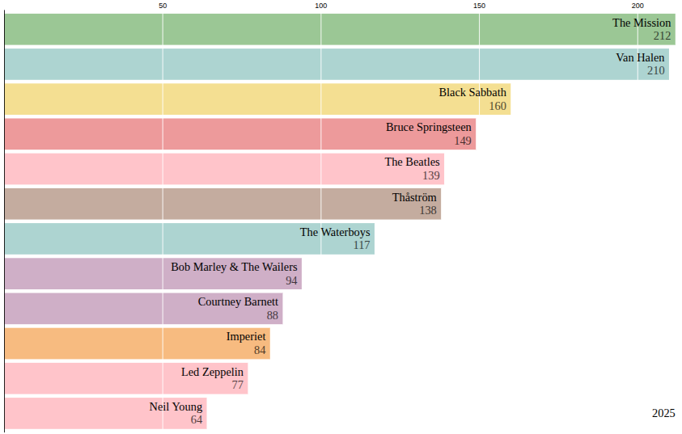

# Last.fm Top Artists Aggregator  

This script fetches your listening history from [Last.fm](https://www.last.fm/) and builds a cumulative ranking of your **top 20 artists** over time.  
You can aggregate results **per month** or **per week**, and the output is saved to a CSV file for further analysis or visualization.  

---

## Features  
- Fetches listening history (scrobbles) from Last.fm using their public API.  
- Aggregates artist frequencies **cumulatively** over time.  
- Supports both **monthly** and **weekly** aggregation.  
- Prints the **top 5 artists** for each period to the console.  
- Writes the **top 20 artists** for each period to a CSV file.  
- Groups multiple artist names into one (e.g., solo vs. band names).  
- Fetches each artist’s **top tag** from Last.fm (used as category, e.g., "rock", "reggae") and caches it locally.  
- Uses caching to avoid refetching data or categories that were already retrieved.  

---

## Uses
You can use the generated data with d3.js to create Bar Chart Races like this:



---

## Requirements  
- Python 3.8+  
- Packages:  
  ```bash
  pip install requests pandas
  ```

---

## ⚙️ Setup

1.  **Get a Last.fm API key**

    Register at [Last.fm API](https://www.last.fm/api). Create an application and copy your API key.

2.  **Configure the script**

    Edit the script and set your credentials:

    ```python
    API_KEY = 'your_api_key'
    USER = 'your_lastfm_username'
    ```

    Choose aggregation mode:

    ```python
    AGGREGATION = "monthly"  # or "weekly"
    ```

3.  **Run the script**

    ```bash
    python top_artists.py
    ```

## 📊 Output

### Console

Prints the top 5 cumulative artists after each period:

```
Top 5 artists for 2007-05-01:
Muse: 120 plays
Bob Marley: 90 plays
The Beatles: 75 plays
Radiohead: 60 plays
Peps: 55 plays
```

### CSV file (top_20_artists.csv)

The output CSV contains the top 20 artists per period.

**Columns:**

*   `date`: Period start (month or week)
*   `name`: Artist (with groupings applied)
*   `category`: Top tag (e.g., genre)
*   `value`: Cumulative play count

**Example:**

| date       | name       | category | value |
| :--------- | :--------- | :------- | :---- |
| 2007-05-01 | Muse       | rock     | 120   |
| 2007-05-01 | Bob Marley | reggae   | 90    |
| 2007-05-01 | The Beatles| pop      | 75    |
| 2007-05-01 | Peps       | blues    | 55    |

## 💾 Caching

*   Play history is cached in `lastfm_cache.json` by period (month/week).
*   Artist categories (tags) are cached in `artist_categories_cache.json`.

Re-running the script will use cached data where available, reducing API calls.

## 🔧 Customization

### Group artist names

Merge multiple names under one label by editing `artist_groups`:

```python
artist_groups = {
    "Peps": ["peps persson", "peps blodsband"]
}
```

### Change start date

Adjust the starting point for fetching history:

```python
start_year = 2007
start_month = 5
```

## 📝 Notes

*   The script retrieves cumulative rankings, not isolated per-month or per-week charts.
*   Categories are based on the top tag returned by Last.fm, which may vary in accuracy.

---
